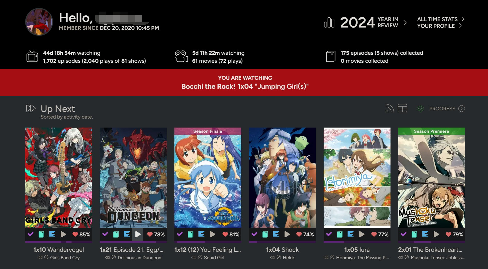

# trakt-scrobble

A MPV script that checks in your movies and shows with Trakt.tv without the need for an IPC server.

|  |  |
| ------------------------------------------ | -------------------------------------------- |

**Requires curl**

## How to install?


### Installing

The install is pretty simple and can be done with the following steps:

1. Clone the entire project into the mpv's scripts folder
   - To do it in one command:
     ```
	   git clone 'https://github.com/dyphire/trakt-scrobble' ~/.config/mpv/scripts/trakt-scrobble

Ok the hard part is done, now you'll do the rest in mpv. If you did everything correctly when you open a file the following message will appear: 


Press X and follow the instructions on the screen. After that you are all set 😀.

### Custom API (optional)

The config.json file comes with a set of predefined trakt.tv api's that you can replace with your own (not necessary).

1. Create a trakt.tv api. You can do this using: [https://trakt.tv/oauth/applications](https://trakt.tv/oauth/applications)
2. Base64 your **client_id** and **client_secret**, then copy them to **trakt-scrobble/config.json**

## Behaviors

The current behaviors adopted by the plugin are:

 - It will start a scrobble as soon as the video starts.
 - The scrobble will stop when playback is paused or ended.
 - Right now there really isn't a good error reporting. So if you find an error I suggest you look at the mpv console.

## Improvements

Some improvements that can be done are:

- [ ] Start scrobbing only after x seconds of playback. This would avoid acidental scrobbles.
- [x] Allow the user to cancel a scrobble.
- [x] Allow a backup plan for when the show/movie isn't recognized.

## Contributing

Pull requests are very welcome. I don't have a strict CONTRIBUTING guide since this is a small project, so just make sure you are clear on what you worked on 😉.

## License

[MIT](https://choosealicense.com/licenses/mit/)
