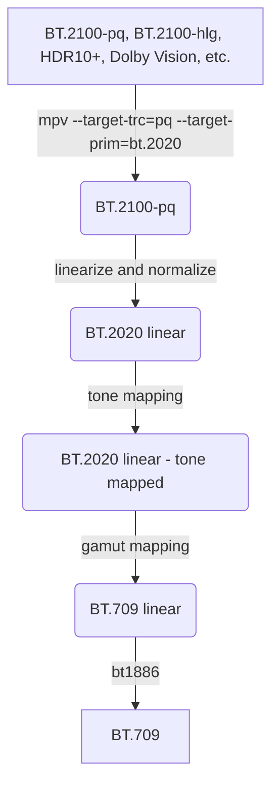

# HDR-toys

Put this in your `mpv.conf`.  
Default combination matches ITU-R BT.2446 Conversion Method C.

Note: `vo=gpu-next` is required, the minimum version of mpv required is v0.35.0.

```ini
vo=gpu-next

[bt.2100]
profile-cond=get("video-params/sig-peak") > 1
profile-restore=copy
target-trc=pq
target-prim=bt.2020
glsl-shader=~~/shaders/hdr-toys/utils/clip_both.glsl
glsl-shader=~~/shaders/hdr-toys/transfer-function/pq_to_l.glsl
glsl-shader=~~/shaders/hdr-toys/transfer-function/l_to_linear.glsl
glsl-shader=~~/shaders/hdr-toys/utils/crosstalk.glsl
glsl-shader=~~/shaders/hdr-toys/utils/chroma_correction.glsl
glsl-shader=~~/shaders/hdr-toys/tone-mapping/bt2446c.glsl
glsl-shader=~~/shaders/hdr-toys/utils/crosstalk_inverse.glsl
glsl-shader=~~/shaders/hdr-toys/gamut-mapping/compress.glsl
glsl-shader=~~/shaders/hdr-toys/transfer-function/linear_to_bt1886.glsl
```

Also you can use it to get a better experience to play BT.2020 content.

```ini
[bt.2020]
profile-cond=get("video-params/primaries") == "bt.2020" and get("video-params/sig-peak") == 1
profile-restore=copy
target-prim=bt.2020
glsl-shader=~~/shaders/hdr-toys/transfer-function/bt1886_to_linear.glsl
glsl-shader=~~/shaders/hdr-toys/gamut-mapping/compress.glsl
glsl-shader=~~/shaders/hdr-toys/transfer-function/linear_to_bt1886.glsl
```

## What are these? What are they for?

### Workflow



### Tone mapping

You can change the [tone mapping operator](https://github.com/Natural-Harmonia-Gropius/mpv_config/tree/main/portable_config/shaders/hdr-toys/tone-mapping) by replacing this line.  
For example, use reinhard instead of bt2446c.

```diff
- glsl-shader=~~/shaders/hdr-toys/tone-mapping/bt2446c.glsl
+ glsl-shader=~~/shaders/hdr-toys/tone-mapping/reinhard.glsl
```

This table lists the features of operators.[^1]

| Operator   | Applied to  | Conversion peak       |
| ---------- | ----------- | --------------------- |
| bt2390[^5] | Ictcp       | HDR peak[^2]          |
| bt2446a    | YCbCr       | HDR peak              |
| bt2446c    | xyY         | 1000nit (adjustable)  |
| reinhard   | YRGB        | HDR peak              |
| hable      | YRGB        | HDR peak              |
| hable2     | YRGB        | HDR peak              |
| suzuki     | YRGB        | 10000nit (adjustable) |
| uchimura   | YRGB        | 1000nit               |
| lottes     | maxRGB      | HDR peak              |
| hejl2015   | RGB         | HDR peak              |
|            |             |                       |
| clip       | RGB         | SDR peak[^3]          |
| linear     | YRGB        | HDR peak              |
| heatmap    | Various[^4] | 10000nit              |

[^1]: Operators below the blank row are for testing purposes.
[^2]:
    Default to 1000nit.  
    You can also set it manually like this `set glsl-shader-opts L_hdr=N`  
    [hdr-toys-helper.lua](https://github.com/Natural-Harmonia-Gropius/mpv_config/blob/main/portable_config/scripts/hdr-toys-helper.lua) can get it automatically from the video's metadata.

[^3]:
    Default to 203nit.  
    You can also set it manually like this `set glsl-shader-opts L_sdr=N`  
    In some color grading workflows it is 100nit.

[^4]:
    You can set it by `set glsl-shader-opts heatmap/enabled=N`  
    N = 1:Y, 2:maxRGB, 3:meanRGB (arithmetic), 4:meanRGB (geometric), 5: Intensity

[^5]:
    That the BT.2390 EETF designed for display transform,  
    To get the desired result, you need to set reference white to your monitor's peak white by `set glsl-shader-opts L_sdr=N`.  
    To adapt the black point, you need to set the contrast to your monitor's contrast by `set glsl-shader-opts CONTRAST_sdr=N`.

### Crosstalk

This is a part of tone mapping, the screenshot below will show you how it works.  
You can see that it makes the color less chromatic when tone mapping and the lightness between colors more even.  
And for non-perceptual conversions (e.g. hejl2015) it brings highlights desaturation.  
You can set the intensity of it by `set glsl-shader-opts alpha=N`.

| without crosstalk_inverse                                                                                       | heatmap, Y, alpha=0                                                                                             | heatmap, Y, alpha=0.3                                                                                           | hejl2015, RGB, alpha=0                                                                                          | hejl2015, RGB, alpha=0.3                                                                                        |
| --------------------------------------------------------------------------------------------------------------- | --------------------------------------------------------------------------------------------------------------- | --------------------------------------------------------------------------------------------------------------- | --------------------------------------------------------------------------------------------------------------- | --------------------------------------------------------------------------------------------------------------- |
|  |  |  |  |  |

### Chroma correction

This is a part of tone mapping, also known as "highlights desaturate".  
In the real world, the brighter the color, the less saturated it becomes, and eventually it turns white.  
You can set the intensity of it by `set glsl-shader-opts sigma=N`.

| `sigma=0`                                                                                                       | `sigma=0.06`                                                                                                    | `sigma=1`                                                                                                       |
| --------------------------------------------------------------------------------------------------------------- | --------------------------------------------------------------------------------------------------------------- | --------------------------------------------------------------------------------------------------------------- |
|  |  |  |

You may have noticed that the high lightness blue has turned purple, this is a defect of LABch, if there is any actual case showing bad results I will switch to JzCzhz to solve this.

### Gamut mapping

matrix is aimed at accurate conversion, but the volume of BT.2020 larger than BT.709, so the converted result may out of [0, 1].  
compress brings back the colors that are out of volume by reducing the distance of the achromatic axis.  
warning shows the excess volume after the conversion in inverted color.

| matrix                                                                                                          | compress                                                                                                        | warning                                                                                                         |
| --------------------------------------------------------------------------------------------------------------- | --------------------------------------------------------------------------------------------------------------- | --------------------------------------------------------------------------------------------------------------- |
|  |  |  |
