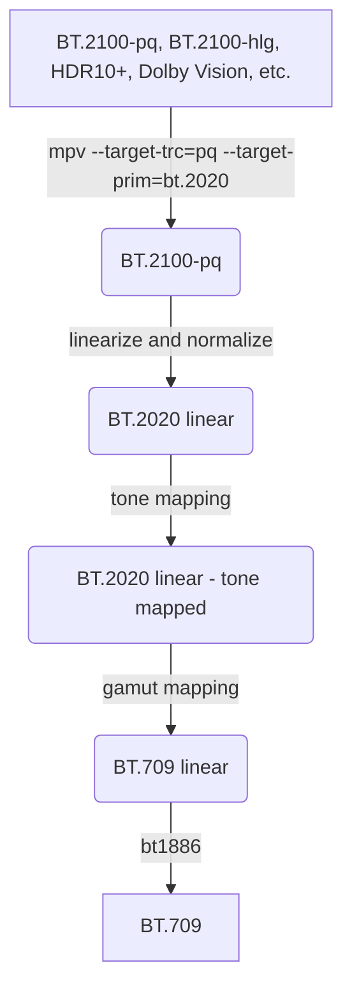

# HDR Toys

Componentized Rec.2100 to Rec.709 color conversion shaders for mpv-player and libplacebo, include dynamic tone-mapping curve and uniform tone-mapping color space.

## How to use?

Put this in your `mpv.conf`.

```ini
vo=gpu-next

[bt.2100]
profile-cond=get("video-params/sig-peak") > 1
profile-restore=copy
target-trc=pq
target-prim=bt.2020
glsl-shader=~~/shaders/hdr-toys/utils/clip_both.glsl
glsl-shader=~~/shaders/hdr-toys/transfer-function/pq_to_l.glsl
glsl-shader=~~/shaders/hdr-toys/transfer-function/l_to_linear.glsl
glsl-shader=~~/shaders/hdr-toys/utils/crosstalk.glsl
glsl-shader=~~/shaders/hdr-toys/utils/chroma_correction.glsl
glsl-shader=~~/shaders/hdr-toys/tone-mapping/dynamic.glsl
glsl-shader=~~/shaders/hdr-toys/utils/crosstalk_inverse.glsl
glsl-shader=~~/shaders/hdr-toys/gamut-mapping/compress.glsl
glsl-shader=~~/shaders/hdr-toys/transfer-function/linear_to_bt1886.glsl
glsl-shader-opts-add=crosstalk/alpha=0
glsl-shader-opts-add=crosstalk_inverse/alpha=0
```

- `vo=gpu-next` is required, the minimum version of mpv required is v0.35.0.
- Dolby Vision Profile 5 is not tagged as HDR by mpv, so it wouldn't activate this auto-profile.

Also you can use it to get a better experience to play BT.2020 content.

```ini
[bt.2020]
profile-cond=get("video-params/primaries") == "bt.2020" and get("video-params/sig-peak") == 1
profile-restore=copy
target-prim=bt.2020
glsl-shader=~~/shaders/hdr-toys/transfer-function/bt1886_to_linear.glsl
glsl-shader=~~/shaders/hdr-toys/gamut-mapping/compress.glsl
glsl-shader=~~/shaders/hdr-toys/transfer-function/linear_to_bt1886.glsl
```

- If you use `gamut-mapping/matrix` here, you will see that the result is different from mpv (vo=gpu-next), this is due to the black point of BT.1886, I personally consider that the black point in color conversion is always 0.

## What are these? What are they for?

### Workflow



### Tone mapping

You can change the tone mapping operator by replacing this line.  
For example, use bt2446c instead of dynamic.

```diff
- glsl-shader=~~/shaders/hdr-toys/tone-mapping/dynamic.glsl
+ glsl-shader=~~/shaders/hdr-toys/tone-mapping/bt2446c.glsl
```

This table lists the features of operators.

- Operators below the blank row are for testing and should not be used for watching.

| Operator | Applied to | Conversion peak |
| -------- | ---------- | --------------- |
| dynamic  | JzCzhz     | Frame peak      |
| bt2390   | ICtCp      | HDR peak        |
| bt2446a  | YCbCr      | HDR peak        |
| bt2446c  | xyY        | 1000nit         |
| reinhard | YRGB       | HDR peak        |
| hable    | YRGB       | HDR peak        |
| hable2   | YRGB       | HDR peak        |
| suzuki   | YRGB       | 10000nit        |
| uchimura | YRGB       | 1000nit         |
| lottes   | maxRGB     | HDR peak        |
| hejl2015 | RGB        | HDR peak        |
|          |            |                 |
| clip     | RGB        | SDR peak        |
| linear   | YRGB       | HDR peak        |
| local    | YRGB       | Block peak      |
| heatmap  | Y          | 10000nit        |

Typical representation of the same curve applied to different color spaces.
| RGB | YRGB | maxRGB | Hybrid in JzCzhz |
| --------------------------------------------------------------------------------------------------------------- | --------------------------------------------------------------------------------------------------------------- | --------------------------------------------------------------------------------------------------------------- | --------------------------------------------------------------------------------------------------------------- |
|  |  |  |  |

Typical representation of static and dynamic curves applied to the same color space.
| bt.2446c | dynamic |
| --------------------------------------------------------------------------------------------------------------- | --------------------------------------------------------------------------------------------------------------- |
|  |  |
|  |  |
|  |  |

- HDR peak defaults to 1000nit.  
  You can set it manually with `set glsl-shader-opts L_hdr=N`  
  [hdr-toys-helper.lua](https://github.com/natural-harmonia-gropius/mpv-config/blob/master/portable_config/scripts/hdr-toys-helper.lua) can get it automatically from the mpv's video-out-params/sig-peak.

- SDR peak defaults to 203nit.  
  You can set it manually with `set glsl-shader-opts L_sdr=N`  
  In some grading workflows it is 100nit, if so you'll get a dim result, unfortunately you have to guess the value and set it manually.

- That the BT.2390 EETF designed for display transform,  
  To get the desired result, you need to set reference white to your monitor's peak white by `set glsl-shader-opts L_sdr=N`.  
  To adapt the black point, you need to set the contrast to your monitor's contrast by `set glsl-shader-opts CONTRAST_sdr=N`.

### Chroma correction

This is a part of tone mapping, also known as "highlights desaturate".  
You can set the intensity of it by `set glsl-shader-opts sigma=N`.

In real world, the brighter the color, the less saturated it becomes, and eventually it turns white.

| `sigma=0`                                                                                                       | `sigma=0.2`                                                                                                     | `sigma=1`                                                                                                       |
| --------------------------------------------------------------------------------------------------------------- | --------------------------------------------------------------------------------------------------------------- | --------------------------------------------------------------------------------------------------------------- |
|  |  |  |

### Crosstalk

This is a part of tone mapping, the screenshot below will show you how it works.  
You can set the intensity of it by `set glsl-shader-opts alpha=N`.

It makes the color less chromatic when tone mapping and the lightness between colors more even.  
And for non-perceptual conversions (e.g. hejl2015) it brings achromatically highlights.

| without crosstalk_inverse                                                                                       | heatmap, Y, alpha=0                                                                                             | heatmap, Y, alpha=0.3                                                                                           | hejl2015, RGB, alpha=0                                                                                          | hejl2015, RGB, alpha=0.3                                                                                        |
| --------------------------------------------------------------------------------------------------------------- | --------------------------------------------------------------------------------------------------------------- | --------------------------------------------------------------------------------------------------------------- | --------------------------------------------------------------------------------------------------------------- | --------------------------------------------------------------------------------------------------------------- |
|  |  |  |  |  |

### Gamut mapping

`matrix` is the exact conversion.  
`compress` restores the excess color by reducing the distance of the achromatic axis.  
`warning` shows the excess color after conversion as inverse color.

| matrix                                                                                                          | compress                                                                                                        | warning                                                                                                         |
| --------------------------------------------------------------------------------------------------------------- | --------------------------------------------------------------------------------------------------------------- | --------------------------------------------------------------------------------------------------------------- |
|  |  |  |
